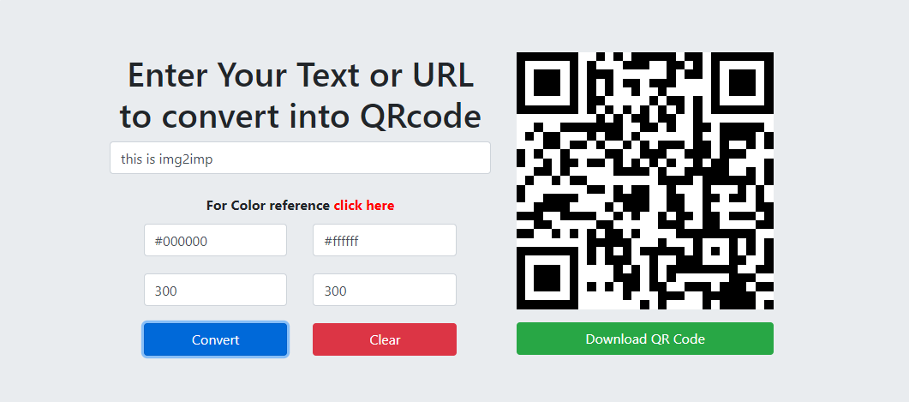

# qrcode-html-js
Convert text and URLs to QR Code With simple HTML and JavaScript
 
<h3><b>Demo <a href="http://tutorials.img2imp.com/web/tools/text-and-url-to-qrcode" target="blank">Click here</a></b><h3>

